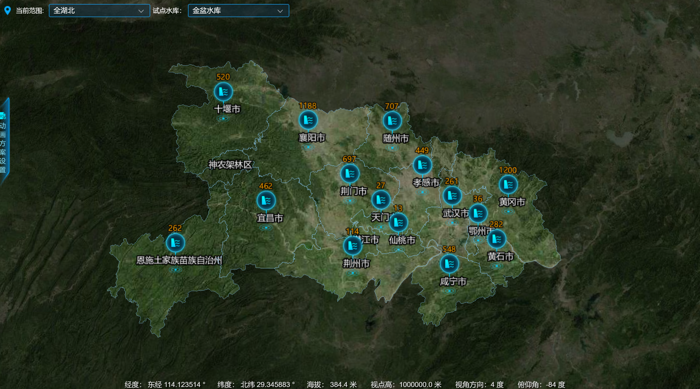
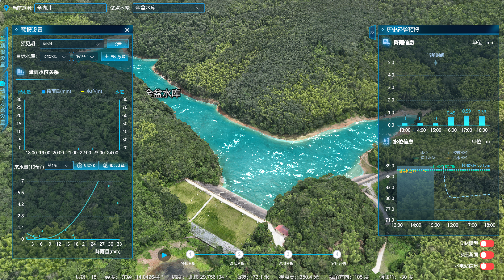

<!--
 * @Author: 陈巧龙
 * @Date: 2023-11-29 14:43:47
 * @LastEditors: Please set LastEditors
 * @LastEditTime: 2024-02-21 15:57:25
 * @FilePath: \git-skxlsyb\README.md
 * @Description: 
-->

# 水科学来水预报

## 项目介绍

1、本项目采用Vue2 + Element UI + Vuex + Echarts + three.js进行编写，地图展示方面采用的是Cesium.js，旨在为湖北省内的试点水库提供信息，支持决策制定，以最大程度地减少洪水风险和提高公众安全。

2、部分代码未进行展示，目前项目正在优化中，后续再进行更新。

3、欢迎大家一起沟通交流。

## 项目启动

### 依赖安装

> npm install

### 启动项目

> npm run serve

## 参考资料

##### 1、[Vue2](https://v2.cn.vuejs.org/)

##### 2、[JavaScript](https://developer.mozilla.org/zh-CN/docs/Web/JavaScript/Reference/Global_Objects)

##### 3、[Cesium API](https://cesium.com/learn/cesiumjs/ref-doc/)

##### 4、[Three.js](https://threejs.org/)

##### 5、[Element UI](https://element.eleme.io/#/zh-CN)

##### 6、[ECharts](https://echarts.apache.org/zh/index.html)

## 界面展示

